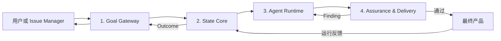

# 自主 AI 产品工厂：最小概念设计

> 状态：概念设计 v0.4（压缩版）  
> 核心链路：`人 → AI → 产品`  
> 原则：先证明最小闭环，再增加系统、对象或 Agent。

## 1. 目标

用户只提供两类输入：

- Goal：最终想得到什么产品或变化；
- Boundary：不可违反的约束、预算、目标环境和预授权范围。

AI 负责理解、探索、设计、实现、验证、发布和修复。用户正常情况下不阅读 PRD、架构稿、Agent 对话、Review 报告或 checkpoint，只接触最终产品。

成功时交付 `Product`；不能安全交付时返回一个简短 Outcome，而不是让用户替 AI 审查中间过程。

## 2. 最小架构：四个组件



| 组件 | 只负责什么 |
|---|---|
| Goal Gateway | 接入飞书、Linear、Jira 等请求，形成版本化 Goal，并投影最终 Outcome |
| State Core | 保存当前基线、证据和运行引用；编译任务上下文；执行产物保留与回收 |
| Agent Runtime | 生成 Task，启动 Agent，管理分支、checkpoint、恢复和副作用 |
| Assurance & Delivery | 用可执行 Oracle 验证候选，选择、发布、观测和回滚 |

权限、预算、审计和索引是四个组件共同遵守的策略，不在第一版拆成更多“大系统”。这四个组件也不等于四个微服务；概念验证可以先是一个服务、一个隔离执行器和一个状态库。

## 3. 主循环

```text
外部请求
  → 编译 Goal Revision
  → 固定 Baseline
  → 生成一个带 Oracle 的 Task
  → 为 Task 编译最小 Context View
  → Agent 在隔离 Run 中产生 Candidate
  → 系统收集 Evidence 并执行 Gate
      ├─ 失败：Finding 回到 Runtime，生成修复 Task
      ├─ 不确定：补证；预算耗尽则停止
      └─ 通过：发布 Product Revision
  → 运行反馈形成新 Evidence 或新 Task
  → 清理无用中间产物
```

新需求或改变产品含义的反馈必须创建新的 Goal Revision；运行指标不能偷偷改写原目标。

## 4. 最小对象集

第一版只保留九种核心记录，它们不是九个服务：

| 对象 | 含义 |
|---|---|
| Goal Revision | 不可变的目标、验收意图和 Boundary 引用 |
| Baseline | 本次工作的 Goal、源码/配置快照、当前产品和策略版本 |
| Task | 目标、输入、期望 Delta、Oracle、Coverage、预算和停止条件 |
| Run | 一次执行尝试；包含 branch、执行游标和租约 |
| Candidate | Agent 产生但尚未被正式采用的代码、配置或方案 |
| Evidence | 带来源、版本、范围和时间的观察或检查结果 |
| Checkpoint | 恢复 Run 所需的引用清单，不保存 Agent 的完整“思想” |
| Effect | 外部写操作的意图、幂等键、状态和回执 |
| Product Revision | 通过 Gate 的正式产品版本；Outcome 只引用它或说明失败 |

Context View 是按 Task 临时计算的，不是长期对象。只有当现有九种记录无法表达一条具有独立生命周期的规则时，才考虑增加新类型。

## 5. 信任模型

系统不信任任何 Agent，包括 Goal Compiler、Producer、Reviewer 和 Judge：

1. 所有 AI 输出默认是 Candidate 或 Finding，不是事实和产品。
2. Goal 的每个解释必须能反向定位原始请求；无法消歧才询问用户。
3. “没有发现”必须携带检查范围；未覆盖区域保持 Unknown。
4. LLM Review 只能提出 Finding，硬 Gate 至少需要一个独立可观察信号。
5. 多 Agent 用于扩大探索和寻找反例，不用投票制造真相。
6. Checkpoint 只证明状态已保存，不证明内容正确。
7. 无法在预算内通过 Gate 时不发布，不能降低标准伪造完成。

系统仍无法数学证明自己完全理解了开放式人类意图。它能做的是保留原始目标、检测遗漏和歧义、使用独立行为信号，并在证据不足时拒绝交付。

## 6. Agent 不是固定组织架构

“产品经理、架构师、开发、Reviewer”是可调用能力，不是四个永远存在的岗位：

- 简单修改可能只有探索、实现和验证；
- 开放方案可以 fork 多个候选；
- 高风险任务增加独立安全或运行验证；
- Reviewer 的输出仍需可复现 Evidence，不能直接批准产品。

Agent 之间不传聊天总结。后序 Agent 获得 Goal、Baseline、Task、必要 Evidence、当前 Delta、Unknown 和稳定引用。

## 7. 对外状态

```text
DELIVERED             已交付 Product Revision
NEEDS_GOAL_INPUT      最终产品含义存在无法自动消除的歧义
NEEDS_BOUNDARY_INPUT  缺少环境、预算、身份或预授权
NO_SAFE_RELEASE       在约束和预算内没有通过 Gate 的候选
CANCELLED             授权来源取消了当前 Goal Revision
SYSTEM_FAULT          工厂自身故障且自动恢复预算耗尽
```

外部系统可以显示 `RECEIVED/RUNNING`，但不回写内部计划、Agent 对话或候选列表。

## 8. 代码需求示例

用户提出：“给订单创建接口增加可配置幂等保护，并交付可运行版本。”

系统内部会检查请求语义，枚举代码入口与远端配置，生成实现候选，用并发和兼容 Oracle 验证，并在隔离环境发布。产品、架构、开发和 Review 能力可以按需出现，但它们只交换版本化状态和 Evidence。

用户最终只看到新版本；如果远端配置不可访问且无法证明开关行为，系统返回 `NO_SAFE_RELEASE`，不会要求用户阅读一份架构争论来替它决定是否上线。

## 9. 文档导航

总纲足以理解整体设计。只有处理对应问题时才读取专题：

| 问题 | 专题 |
|---|---|
| Agent 如何获得上下文，如何避免错误认知继承 | [01-context-and-trust.md](01-context-and-trust.md) |
| Agent 如何运行、续用、fork、merge 和处理副作用 | [02-runtime.md](02-runtime.md) |
| 大量中间产物如何限制、晋升和回收 | [03-artifacts.md](03-artifacts.md) |
| 飞书表格、飞书任务、自有 Issue Manager 和 Orca 如何衔接 | [04-integrations.md](04-integrations.md) |
| 研究来源 | [REFERENCES.md](REFERENCES.md) |

## 10. 明确不做什么

- 不先建设通用自治组织、全量知识图谱或 Agent 市场；
- 不把每个风险都升级成一个微服务或永久对象；
- 不保存所有对话、摘要、候选和工具输出；
- 不让 Issue Manager 兼任项目记忆和运行数据库；
- 不用“多 Agent”本身代替测试、证据和产品反馈；
- 不在概念阶段规定数据库表、消息队列和部署拓扑。

## 11. 设计产物预算

本文档体系本身也遵守产物治理：

- 活跃设计只允许 `1 个总纲 + 4 个专题 + 1 个冷参考`；
- 一条规则只有一个主要归属，不在多份文件复制；
- 调研过程、争论和被淘汰模型不进入活跃目录；
- 新文件必须说明独立读者和独立生命周期，否则合并进现有专题；
- 总纲能删除的细节就下沉，专题能删除的历史就不归档；
- 文档增长超过预算时先压缩或替换，不默认新增。

