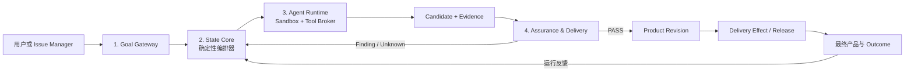

# 自主 AI 产品工厂：最小可实施设计

> 状态：v0.7（2026-07-20 增量：Intake 澄清会话为主入口；控制面上云、执行面跟随代码；Project 注册表与文档 Provider。v0.6 依据深度研究修订，见 [REFERENCES.md](REFERENCES.md)）  
> 核心链路：`人 → AI → 产品`  
> 原则：确定性控制面拥有状态、权限、判断和发布权；Agent 只执行非权威 Task 并提交类型化结果。自主度不是架构假设，而是用零容忍指标逐级解锁的特权。

## 1. 目标与首版边界

用户只提供两类输入：

- Goal：最终想得到什么产品或变化；
- Boundary：不可违反的约束、预算、目标环境、交付模式和预授权范围。

Goal Gateway 将它们编译为不可变 Goal Revision，并保存双向 Goal Coverage Manifest：每条 Contract 采用 EARS 式结构化句式并引用原始 span 或版本化默认策略。歧义处理分两级：

- **零容忍类**：命令、硬约束、交付对象和 Boundary 的每个 span 必须映射到 Contract 或 `BLOCKING` Unknown，不允许 omission，不可信 Goal Compiler/Agent 无权自行降级；无法消除的歧义返回 `NEEDS_GOAL_INPUT`。
- **分级类**：描述性内容由版本化 Classification Policy 按置信度分级——高置信项直接映射并记录假设，低置信项汇总为一次性澄清（一次问完，不反复打断），允许的非规范性 omission 记录 `reason / policy_revision`。

Goal Revision 本身不可变，但**契约是活的**：新信息、实现中暴露的歧义或约束通过创建新 Revision 收敛，这是正常回路而非异常（一线 spec-driven 实践已证明“编译一次、冻结全部”是瀑布回潮）。LLM 歧义检测呈高召回低精度、且模型倾向沉默假设而非提问，因此澄清率与澄清精度是从 M0 起持续度量的一级指标，不追求零打断，也不允许为压打断率而放松零容忍类。AI 负责探索、实现、验证和交付；正常路径不要求用户阅读中间产物。

交付模式必须显式声明：

| Delivery Mode | `DELIVERED` 的含义 |
|---|---|
| `ARTIFACT_ONLY` | 已封存并验证不可变制品 |
| `PULL_REQUEST` | PR 创建 Effect 已确认；只有 Goal 明确要求 PR 时它才是最终产品 |
| `STAGING` | 指定测试环境的 Release 已健康 |
| `PRODUCTION` | 指定生产环境的 Release 已健康 |

系统适配任意 Git 仓库，不绑定靶场：仓库在 **Project 注册表**登记一次（仓库引用、Repo Profile 默认值、外部文档/工作项引用、Worker 路由标签），每个 Goal 挂在一个 Project 下；语言栈、构建/测试/部署命令由 **Repo Profile** 声明并随 Baseline Snapshot 冻结；执行统一使用隔离 branch/worktree、自动构建与受保护验证，主交付模式为 `STAGING`。

人的主入口是 Web Console 的 **Intake 澄清会话**：人先与只读 Clarifier Agent 对话（Agent 可用只读工具查看目标仓库与引用文档，能自行查明的不问人，一次最多问 1-2 个关键问题），把需求澄清为自包含的 Goal 草稿——执行者看不到对话，草稿必须独立成立并含验收标准；人确认草稿后才编译 Goal Revision 并开工。直接提交表单是次级入口，飞书等连接器后置（见 [04-integrations.md](04-integrations.md)）。交付自主度按证据阶梯解锁：

1. **M1**：只产出 `ARTIFACT_ONLY`；
2. **M2 监督式 STAGING**：验证、部署、观察、回滚全自动，Release 晋升需一次显式人工批准——批准者只读 Outcome 摘要、Assessment 结论和 Release 计划（目标耗时 <2 分钟），不读中间产物；
3. **M3 无人 STAGING**：连续 N 个任务（N≥50）零误交付、零 Gate 绕过、批准否决率趋近于零后，按变更风险类别逐类移除批准步骤。

截至 2026 年没有公开生产系统实现无人参与部署（Devin/Codex/Copilot agent 全部止于“沙箱自主 + 人工 review”）；本设计凭隔离 Staging 靶场可以走得更远，但无人化必须由 M0/M1 的零容忍指标买单。不支持生产发布、多仓协议变更、不可逆数据迁移、长期密钥或远端配置写入。PR 可以是审计投影。

## 2. 最小架构：四个组件



| 组件 | 唯一职责 |
|---|---|
| Goal Gateway | 用持久 Inbox 接入飞书、Linear、Jira 等请求，编译 Goal Revision，并通过 Outbox 投影最终 Outcome |
| State Core | 保存权威 revision；由确定性控制器校验 Task Graph、执行状态迁移、预算、lease/fencing、Context 编译和保留策略 |
| Agent Runtime | claim 由控制器为 READY Task 创建的 QUEUED Run，在隔离环境执行 Agent；Tool & Capability Broker 是所有工具、密钥和真实副作用的强制边界 |
| Assurance & Delivery | 运行受保护验证，生成 Assessment，晋升 Product Revision，并管理 Release、观察和回滚 |

四个组件不是四个微服务。MVP 可以是一个控制面进程、一个 Runner 池、一个关系型状态库，加对象存储和 Git/制品存储。Broker、Release Controller、Inbox/Outbox 和 Operator Plane 都是组件内边界或横切视图，不另建顶层系统。

部署形态遵循**控制面上云、执行面跟随代码**：控制面（权威状态、队列、通知）可托管云端，但不持有代码与模型凭据；Clarify 与 Run 都由装在持有仓库和凭据机器上的 Worker 守护进程**出站认领**执行（无入站端口要求），按 Project 路由标签匹配。Worker 部署在本机还是云上是部署选择，不是架构分叉；单机模式是同一协议的本地合并部署（见 [02-runtime.md](02-runtime.md#9-部署拓扑控制面上云执行面跟随代码)）。

Operator Plane 只用于暂停系统、终止 Run、撤销授权、对账未知 Effect、隔离故障 Runner 和紧急回滚。正常执行不等待 Operator 审批，也不要求 Operator 阅读 Agent 中间产物。

## 3. 动态主循环

```text
外部请求
  → Goal Revision + Acceptance Contract + Delivery Mode
  → Baseline Snapshot
  → Agent 提议 Task Graph
  → 确定性控制器检查 DAG、预算、权限、风险和 Verify-before-Release
  → 控制器为 READY Task 创建 QUEUED Run；Runner claim 后获得最小 Context View 并执行
  → Candidate + Evidence
  → Assessment
      ├─ FAIL：Finding 去重后生成有界 REPAIR / DISCOVER Task
      ├─ INCONCLUSIVE：补证；阻塞 Unknown 或预算耗尽则停止
      └─ PASS：晋升 Product Revision
  → 按 Delivery Mode 确认 Artifact、PR Effect 或环境 Release
  → 满足对应交付条件后输出 DELIVERED
  → 运行反馈形成新 Evidence、Task 或 Goal Revision
```

Task 用 `requires / produces / invalidates / derived_from_finding` 形成可演进图，不增加永久 Plan 对象。Planner 只能提议；控制器负责拒绝环、越权、过期输入、无验证发布和无限 Repair。

新需求或改变产品含义的反馈必须创建新的 Goal Revision。旧 Run 可以结束并保留 Evidence，但不能覆盖新 revision 的 Outcome，也不能晋升或发布旧 Candidate。

## 4. 领域记录

对象数量不是设计目标；只有具有独立生命周期的语义才进入核心记录：

| 生命周期记录 | 含义 |
|---|---|
| Project | 仓库注册表条目：仓库引用、Repo Profile 默认值、外部文档/工作项引用和 Worker 路由标签；Intake 与 Goal 都挂在 Project 下 |
| Intake | 开工前的需求澄清会话：对话消息、引用内容快照与 Goal 草稿；人确认后编译 Goal Revision 并锁定 |
| Goal | 管理当前 Goal Revision、替代、取消和最终 Outcome |
| Task | 不可变执行契约及图依赖；声明类型、输入、Task Oracle、Coverage、权限、预算和停止条件 |
| Run | Task 的一次执行尝试；包含 lease、fencing token、branch、执行游标和 lineage |
| Candidate | Agent 产生、封存但尚未采用的代码、配置或制品 |
| Assessment | 控制器依据版本化 Policy 对 Candidate 或 Claim 做出的正式判断；Candidate Assessment 还绑定 Goal、Baseline 和逐条 Acceptance Coverage |
| Effect | 外部写操作的意图、幂等键、授权、状态、回读和回执 |
| Product Revision | 由当前有效 PASS Assessment 晋升的不可变正式产品版本 |
| Release | Product Revision 到特定环境的一次部署、观察或回滚生命周期 |

不可变支持记录包括 Goal Revision、Baseline Snapshot、Context Manifest、Evidence、Claim、Checkpoint、Artifact Ref、Capability Grant 和 Policy Revision。它们不是额外服务：

- Evidence 是带来源、范围和版本的观察，不能自己给出 PASS；
- Claim 是待判断结论；Finding 是经 Claim-subject `PASS` Assessment 验证成立的缺陷 Claim，并可成为 Candidate Assessment `FAIL/INCONCLUSIVE` 的结构化原因；
- `verified/refuted/stale` 由控制器根据 Assessment 和失效规则导出，Agent 不能直接写；
- Context View 是可删除的运行 payload，Context Manifest 只保存编译版本、输入 digest、遗漏和权限引用；
- Checkpoint 只保存恢复引用，不保存完整聊天或“思想”；
- Capability Grant 的内容不可变，其当前有效性由 expiry、revocation epoch 和 Policy Revision 计算。

## 5. 四层判定语义

“Oracle”不再泛指所有正确性判断：

| 层次 | 所属记录 | 只回答什么 |
|---|---|---|
| Acceptance Contract | Goal Revision | 用户最终要求和不可违反条件是什么 |
| Task Oracle | Task | 当前 DISCOVER/BUILD/VERIFY/REPAIR/RELEASE Task 是否完成 |
| Gate Policy | Assessment | Candidate 是否能晋升为 Product Revision |
| Release SLO | Release | 指定环境中的交付是否健康、是否需要回滚 |

Task 成功不等于 Candidate 可采用，Assessment PASS 不等于环境健康。探索 Task 的 Oracle 是覆盖要求的信息面、产出可复现 Evidence 并分类剩余 Unknown，而不是强行要求功能测试。

## 6. 系统不变量

系统不信任 Goal Compiler、Planner、Producer、Reviewer 或 Judge。Agent 只能提交类型化提议、Candidate、Claim、Evidence 采集请求或工具请求；Evidence 由 Broker/Assurance 根据可追溯观察记录，所有权威状态迁移由控制器完成。

```text
INV-01  Agent 不能绕过控制器直接修改权威状态。
INV-02  Agent 不能获得长期凭证；Secret 不进入 Context、日志或 Evidence payload。
INV-03  每次状态迁移必须校验 expected revision；Run 写入还必须携带当前 fencing token。
INV-04  每个真实外部写操作必须先创建 Effect，超时后先回读而不是直接重发。
INV-05  每个 DELIVERED 必须引用当前 Goal/Baseline/Gate Policy 下逐条覆盖硬 Acceptance Contract 的 Candidate PASS Assessment；Claim PASS 不能替代。
INV-06  STAGING/PRODUCTION 的 DELIVERED 还必须引用 HEALTHY Release。
INV-07  Producer 必须看到 Acceptance Contract 和 Task Oracle；受保护 Gate 材料只能挂载给通过 attestation 的可信 VERIFY executor，Producer 不得读取或修改。
INV-08  Context View 必须对应含 compiler version、输入 digest 和 omission manifest 的 Context Manifest。
INV-09  Goal、Baseline、Policy 或授权失效后，旧 Candidate 不得静默晋升或发布。
INV-10  verified Claim 必须引用 Evidence、scope、Baseline、以该 Claim 为 subject 的 PASS Assessment 和 invalidation rule。
INV-11  旧 Goal Revision 的 Run 可以结束，但不能覆盖新 revision 的 Outcome。
INV-12  相同 Finding 不得无限生成同策略 Repair；必须去重、升级策略或停止。
INV-13  受保护 Gate 材料自身必须先通过质量 Assessment（mutation 阈值、已知正确样本必须通过、已知错误样本必须被拒），才能作为判定依据。
```

多 Agent 遵循**单写者原则**：写操作与发布保持单线程，额外 Agent 只贡献智能——扩大探索、结构性独立验证和寻找反例——不贡献动作，不通过投票制造真相（相同输入下多数投票会在约 1/4 的分歧中压制正确答案）。探索型多 Agent 有 Goal 级预算上限（多 Agent 的 token 成本可达单 Agent 的十余倍）。“产品经理、架构师、开发、Reviewer”是按需能力，不是常驻组织；Agent 之间不传聊天总结。

系统无法数学证明自己完全理解开放式意图。它能做的是保留原始目标、显式 Unknown、追踪 Coverage、使用独立行为信号，并在证据不足时拒绝交付。

## 7. 对外 Outcome

```text
DELIVERED             已达到 Goal Revision 声明的 Delivery Mode
NEEDS_GOAL_INPUT      最终产品含义存在无法自动消除的歧义
NEEDS_BOUNDARY_INPUT  缺少目标环境、预算、身份或预授权
NO_SAFE_DELIVERY      在约束和预算内没有可安全交付的候选
CANCELLED             授权来源取消了当前 Goal Revision
SYSTEM_FAULT          工厂自身故障且自动恢复预算耗尽
```

最终 Outcome 最少包含：

```text
status / delivery_mode
product_revision_ref  DELIVERED 时必填
delivery_effect_ref   PULL_REQUEST 时必填
release_ref           STAGING/PRODUCTION 时必填
assurance_ref          optional，供机器或 Operator 按需查询
```

外部系统可以显示 `RECEIVED/RUNNING`，但不接收内部 Task Graph、Agent 对话、候选列表、完整 Review 或 trace。可以打断用户的只有三类：最终目标歧义（攒批一次问完）、Boundary 缺失、以及未解锁无人化前的一次 Release 批准；其他内部失败由系统修复或收束成 Outcome。

## 8. MVP 与阶段退出条件

| 阶段 | 范围 | 退出条件 |
|---|---|---|
| M0 评测基线 | 从一个或多个样本仓库的历史选取任务、正确 Patch、测试和已知失败样本（仓库通过 Repo Profile 接入，不绑定单一靶场）；校验受保护测试集自身质量（mutation 分数 + 正确/错误样本双向校验，INV-13）；用标注歧义样本校准分级歧义门 | 同一输入可重放；每个判断可追溯 Evidence；能模拟 stale Baseline、Runner 中断、权限撤销和测试篡改；歧义门的精度/召回有基线数字 |
| M1 Candidate Factory | Goal/Task/Run/Candidate/Assessment、隔离 Runner、受保护测试组合防御、Capability Broker、Artifact GC；只产出 `ARTIFACT_ONLY`。实现形态：单进程控制面 + Postgres（见 [02-runtime.md](02-runtime.md#3-权威状态机)实现注记） | 崩溃可恢复；旧 fencing token 写入被拒绝；受保护 Gate 不可被 Candidate 篡改（含硬编码/运算符重载/历史挖掘类作弊）；失败样本不被误判为 DELIVERED |
| M2 监督式 Staging | 自动生成 Task Graph、验证、部署隔离 Staging、观察和回滚；Web Console 作为唯一入口（飞书等连接器后置）；Release 晋升保留一次人工批准 | 除一次发布批准外无人参与；批准平均耗时 <2 分钟且否决率持续下降；重复/乱序事件不产生重复 Goal；未知 Effect 可对账；Release 失败自动回滚或返回 `NO_SAFE_DELIVERY` |
| M3 无人 Staging 与生产 | 达到解锁条件（连续 N≥50 任务零误交付、零 Gate 绕过、否决率≈0）后按风险类别移除 Staging 批准；随后白名单低风险生产发布，再逐步扩展多仓、迁移和配置写入 | 无人化按类别解锁且可随指标回退；另行定义生产 SLO、紧急停止、兼容回滚和合规策略 |

M0 固定质量、成本和延迟基线。安全退出指标先采用不可妥协的零容忍：已知不安全样本误交付数、故障注入后的重复 Effect 数、stale Candidate 发布数和受保护 Gate 绕过数都必须为 `0`。同时持续记录任务成功率、恢复率、端到端延迟、成本和中间产物放大倍数；不能用削减验证换取指标好看。

## 9. 代码需求示例

用户提出：“给订单创建接口增加可配置幂等保护，并交付可运行版本。”Boundary 指定 `STAGING`，Goal Compiler 至少形成这些 Acceptance Contract：

```text
开关关闭时保持原行为
相同幂等键不能创建多个订单
并发重复请求返回契约规定的一致结果
同键不同 payload、失败重试和记录 TTL 行为明确
配置不可达时采用已声明的安全策略
性能开销不超过既定预算
```

控制器校验并执行动态图：

```text
DISCOVER 入口、事务、消息、schema 和配置消费路径
  → BUILD Candidate
  → VERIFY 构建、并发、兼容、开关、故障和篡改保护
  → Assessment
  → Product Revision
  → Release 批准（M2 一次人工批准；M3 达标类别自动）
  → STAGING Release
  → Release SLO 观察
```

如果远端配置不可访问且策略不允许容忍，它成为 `BLOCKING` Unknown，系统返回 `NO_SAFE_DELIVERY`，不会让用户阅读架构争论来替 AI 判断上线风险。

## 10. 文档导航

总纲足以理解整体设计。只有处理对应问题时才读取专题：

| 问题 | 专题 |
|---|---|
| Baseline、Context Manifest、Coverage、Assessment 和独立验证 | [01-context-and-trust.md](01-context-and-trust.md) |
| Task Graph、状态机、恢复、fencing、Capability 和 Release | [02-runtime.md](02-runtime.md) |
| 中间产物如何限制、晋升、索引和回收 | [03-artifacts.md](03-artifacts.md) |
| Project 注册表、Intake、DocProvider、飞书/Issue Manager 连接器、CI/CD 端口和结果投影 | [04-integrations.md](04-integrations.md) |
| 研究来源和参考实现心得 | [REFERENCES.md](REFERENCES.md) |

## 11. 明确不做什么

- 不在首版持有生产权限、执行不可逆迁移或跨仓协议变更；
- 不先建设通用自治组织、全量知识图谱或 Agent 市场；
- 不把每条规则升级成微服务、永久对象或常驻 Agent；
- 不保存所有对话、摘要、候选、评论和工具输出；
- 不让 Issue Manager 兼任项目记忆、运行数据库或权限来源；
- 不用多 Agent、LLM 投票或人工阅读中间产物代替测试、Evidence 和产品反馈；
- 不把无人化当作初始假设：发布批准闸门只能被指标解锁，不能被架构删除；也不为压澄清率而放松零容忍类歧义检查；
- 不先固化数据库表和消息中间件，先用状态机、不变量和故障演练验证语义。

## 12. 设计产物预算

本文档体系本身也遵守产物治理：

- 活跃设计只允许 `1 个总纲 + 4 个专题 + 1 个冷参考`；
- 默认 Context 只加载 README 和当前问题对应的一个专题；不得无条件拼接全部六份文件，`REFERENCES.md` 永不默认加载；
- 一条规则只有一个主要归属，不在多份文件复制；
- 调研过程、争论和被淘汰模型不进入活跃目录；
- 新文件必须说明独立读者和独立生命周期，否则合并进现有专题；
- 总纲能删除的细节就下沉，专题能删除的历史就不归档；
- 文档增长超过预算时先压缩或替换，不默认新增。
